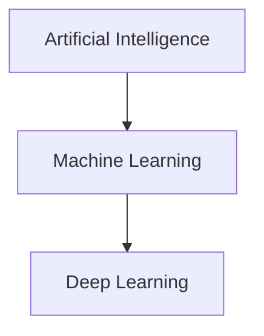
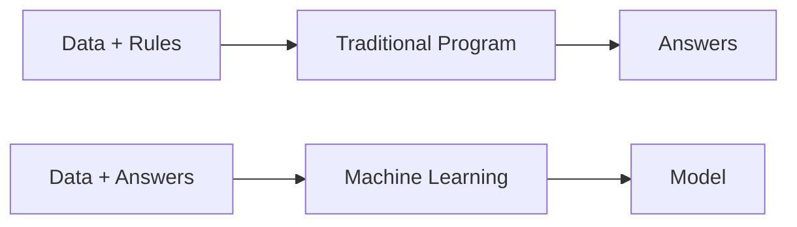

# 1.1 Artificial Intelligence, Machine Learning, and Deep Learning

> **Learning Objectives**
>
> After completing this chapter, you should be able to:
>
> - Define Artificial Intelligence, Machine Learning, and Deep Learning.
> - Explain the relationship between AI, ML, and DL.
> - Describe the evolution of AI.
> - Understand representation learning.
> - Explain why deep learning has become successful.
> - Understand the basic deep learning training process.
> - Identify current capabilities and limitations of AI.

---

# Table of Contents

- 1.1 Artificial Intelligence, Machine Learning, and Deep Learning
    - 1.1.1 Artificial Intelligence
    - 1.1.2 Machine Learning
    - 1.1.3 Learning Representations from Data
    - 1.1.4 The "Deep" in Deep Learning
    - 1.1.5 Understanding How Deep Learning Works
    - 1.1.6 What Deep Learning Has Achieved
    - 1.1.7 Don't Believe the Short-Term Hype
    - 1.1.8 The Promise of AI

---

# Introduction

> Introduce the motivation behind AI and explain why understanding the differences between Artificial Intelligence, Machine Learning, and Deep Learning is important before studying neural networks.

---



---

# 1.1.1 Artificial Intelligence

## Definition

## Historical Background

## Goals of AI

## Types of AI

- Narrow AI
- General AI
- Super AI

## Symbolic AI

## Expert Systems

## Advantages

## Limitations

## Real-world Applications

## Summary

---

# 1.1.2 Machine Learning

## Definition

## Classical Programming vs Machine Learning



## Types of Machine Learning

- Supervised
- Unsupervised
- Semi-supervised
- Reinforcement Learning

## ML Workflow

## Training Data

## Features

## Labels

## Evaluation

## Applications

## Summary

---

# 1.1.3 Learning Representations from Data

## What is a Representation?

## Why Representation Matters

## Feature Engineering

## Representation Learning

## Traditional Feature Engineering vs Automatic Feature Learning

## Examples

## Visualization

```text
Raw Data

↓

Representation

↓

Useful Features

↓

Prediction
```

## Summary

---

# 1.1.4 The "Deep" in Deep Learning

## What Makes Deep Learning Different?

## Layered Representation Learning

## Neural Networks

## Hierarchical Features

## Deep vs Shallow Learning

## Advantages

## Limitations

## Summary

---

# 1.1.5 Understanding How Deep Learning Works

## Neural Network Components

- Input
- Weights
- Bias
- Activation
- Output

## Forward Propagation

## Loss Function

## Optimizer

## Gradient Descent

## Backpropagation

## Training Loop

```text
Input

↓

Prediction

↓

Loss

↓

Backpropagation

↓

Update Weights

↓

Repeat
```

## Summary

---

# 1.1.6 What Deep Learning Has Achieved

## Computer Vision

## Natural Language Processing

## Speech Recognition

## Recommendation Systems

## Healthcare

## Autonomous Vehicles

## Robotics

## Generative AI

## Modern LLMs

---

# 1.1.7 Don't Believe the Short-Term Hype

## Common Misconceptions

## AI Winters

## Current Challenges

## Limitations

## Ethical Concerns

## Reality vs Marketing

---

# 1.1.8 The Promise of AI

## Future Applications

## Scientific Discovery

## Healthcare

## Education

## Robotics

## Climate Science

## Software Engineering

## Responsible AI

---

# AI vs ML vs DL

| Feature | AI | ML | DL |
|----------|----|----|----|
| Goal | | | |
| Data Requirement | | | |
| Human Intervention | | | |
| Scalability | | | |
| Examples | | | |

---

# Timeline

```text
1950 ─ AI

↓

1980 ─ Machine Learning

↓

2012 ─ Deep Learning

↓

2022 ─ Generative AI

↓

Today ─ Foundation Models
```

---

# Key Terminology

| Term | Description |
|------|-------------|
| Artificial Intelligence | |
| Machine Learning | |
| Deep Learning | |
| Dataset | |
| Feature | |
| Label | |
| Representation | |
| Neural Network | |
| Loss Function | |
| Optimizer | |

---

# Interview Questions

1. What is Artificial Intelligence?
2. Explain Machine Learning.
3. What is Deep Learning?
4. AI vs ML vs DL?
5. Why is Deep Learning called "Deep"?
6. What is Representation Learning?
7. What is Feature Engineering?
8. Explain the Training Loop.
9. What is Backpropagation?
10. Why is Deep Learning successful today?

---

# Exercises

- Explain AI, ML, and DL using your own examples.
- Draw the AI → ML → DL hierarchy.
- Compare Symbolic AI and Machine Learning.
- Research one real-world deep learning application.

---

# Summary

- Key points
- Important concepts
- Things to remember

---

# Related Notes

- [[Artificial Intelligence]]
- [[Machine Learning]]
- [[Deep Learning]]
- [[Neural Networks]]
- [[Representation Learning]]
- [[Backpropagation]]
- [[Gradient Descent]]
- [[Loss Functions]]
- [[History of AI]]