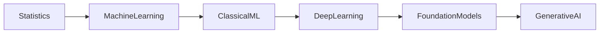

# 1.2 Before Deep Learning: A Brief History of Machine Learning

> **Learning Objectives**
>
> After completing this chapter, you should be able to:
>
> - Understand the historical evolution of machine learning.
> - Explain major machine learning paradigms before deep learning.
> - Compare classical machine learning algorithms.
> - Understand why deep learning replaced many traditional approaches.
> - Identify where classical machine learning is still preferred.

---

# Table of Contents

- Introduction
- Timeline of Machine Learning
- 1.2.1 Probabilistic Modeling
- 1.2.2 Early Neural Networks
- 1.2.3 Kernel Methods
- 1.2.4 Decision Trees, Random Forests, and Gradient Boosting
- 1.2.5 Back to Neural Networks
- 1.2.6 What Makes Deep Learning Different
- 1.2.7 The Modern Machine Learning Landscape
- Summary
- Interview Questions
- Exercises
- Related Notes

---

# Introduction

> Introduce why understanding the history of machine learning is important and explain that deep learning is one stage in the evolution of AI rather than its starting point.

---

# Historical Timeline

```text
1950s
│
Statistical Learning
│
1960s
│
Perceptron
│
1980s
│
Backpropagation
│
1990s
│
Support Vector Machines
│
2000s
│
Decision Trees
Random Forests
│
2010s
│
Deep Learning Revolution
│
2020s
│
Foundation Models
Generative AI
```

---

# Evolution of Machine Learning



---

# 1.2.1 Probabilistic Modeling

## Introduction

## Historical Background

## Bayes' Theorem

## Naive Bayes Classifier

## Logistic Regression

## Advantages

## Limitations

## Applications

## Comparison with Modern Methods

## Summary

---

# 1.2.2 Early Neural Networks

## Perceptron

## Multi-Layer Perceptron

## Backpropagation

## Historical Challenges

## AI Winter

## LeNet

## Milestones

## Summary

---

# 1.2.3 Kernel Methods

## Introduction

## Support Vector Machines

## Hyperplanes

## Decision Boundary

## Margin Maximization

## Kernel Trick

## Popular Kernels

- Linear
- Polynomial
- RBF
- Sigmoid

## Advantages

## Limitations

## Applications

## Summary

---

# Decision Boundary Illustration

```text
Class A

● ● ● ●

────────────── Decision Boundary ──────────────

○ ○ ○ ○

Class B
```

---

# 1.2.4 Decision Trees, Random Forests, and Gradient Boosting

## Decision Trees

### Tree Structure

### Splitting Criteria

### Advantages

### Limitations

---

## Random Forest

### Ensemble Learning

### Bootstrap Sampling

### Voting

### Advantages

### Limitations

---

## Gradient Boosting

### Boosting Concept

### Weak Learners

### XGBoost

### LightGBM

### CatBoost

### Advantages

### Limitations

---

## Comparison Table

| Algorithm | Strengths | Weaknesses | Best Use Cases |
|-----------|-----------|------------|----------------|
| Decision Tree | | | |
| Random Forest | | | |
| Gradient Boosting | | | |

---

# 1.2.5 Back to Neural Networks

## GPU Revolution

## Big Data

## Better Algorithms

## AlexNet

## ImageNet

## Deep Learning Renaissance

## Major Contributors

- Geoffrey Hinton
- Yann LeCun
- Yoshua Bengio

## Summary

---

# Deep Learning Breakthrough Timeline

```text
1986

Backpropagation

↓

1989

LeNet

↓

1998

CNN

↓

2012

AlexNet

↓

2014

GANs

↓

2017

Transformer

↓

2020

GPT-3

↓

2022

ChatGPT

↓

Today

Foundation Models
```

---

# 1.2.6 What Makes Deep Learning Different

## Feature Engineering

## Representation Learning

## End-to-End Learning

## Hierarchical Learning

## Automatic Feature Extraction

## Comparison

| Classical ML | Deep Learning |
|--------------|---------------|
| Manual Features | Automatic Features |
| Small Data | Large Data |
| Fast Training | High Compute |
| Easier Interpretation | Complex Models |

---

# 1.2.7 The Modern Machine Learning Landscape

## Structured Data

## Computer Vision

## Natural Language Processing

## Speech Recognition

## Reinforcement Learning

## Generative AI

## Foundation Models

## Current Trends

---

# Choosing the Right Algorithm

```text
Problem

│

├── Tabular Data

│       │

│       ├── Random Forest

│       ├── XGBoost

│       └── LightGBM

│

├── Images

│       │

│       └── CNN

│

├── Text

│       │

│       └── Transformer

│

└── Audio

        │

        └── Deep Learning
```

---

# Key Milestones

| Year | Event |
|------|-------|
| 1950 | |
| 1958 | |
| 1986 | |
| 1989 | |
| 1995 | |
| 2001 | |
| 2012 | |
| 2017 | |
| 2022 | |

---

# Key Terminology

| Term | Description |
|------|-------------|
| Naive Bayes | |
| Logistic Regression | |
| Perceptron | |
| Backpropagation | |
| Support Vector Machine | |
| Kernel | |
| Decision Tree | |
| Random Forest | |
| Gradient Boosting | |
| CNN | |

---

# Interview Questions

1. Why is understanding the history of machine learning important?
2. What is probabilistic modeling?
3. Explain Naive Bayes.
4. Why is Logistic Regression considered a baseline model?
5. What is a Support Vector Machine?
6. Explain the Kernel Trick.
7. What are Decision Trees?
8. Compare Random Forest and Gradient Boosting.
9. Why did deep learning become popular after 2012?
10. What makes deep learning different from classical machine learning?

---

# Exercises

- Research one historical machine learning algorithm.
- Compare SVM and Decision Trees.
- Explain why GPUs changed deep learning.
- Create a timeline of important ML milestones.

---

# Summary

- Major concepts learned
- Historical milestones
- Key algorithms
- Transition to deep learning

---

# Related Notes

- [[Artificial Intelligence]]
- [[Machine Learning]]
- [[Deep Learning]]
- [[Probabilistic Modeling]]
- [[Naive Bayes]]
- [[Logistic Regression]]
- [[Support Vector Machine]]
- [[Decision Trees]]
- [[Random Forest]]
- [[Gradient Boosting]]
- [[Convolutional Neural Networks]]
- [[Feature Engineering]]