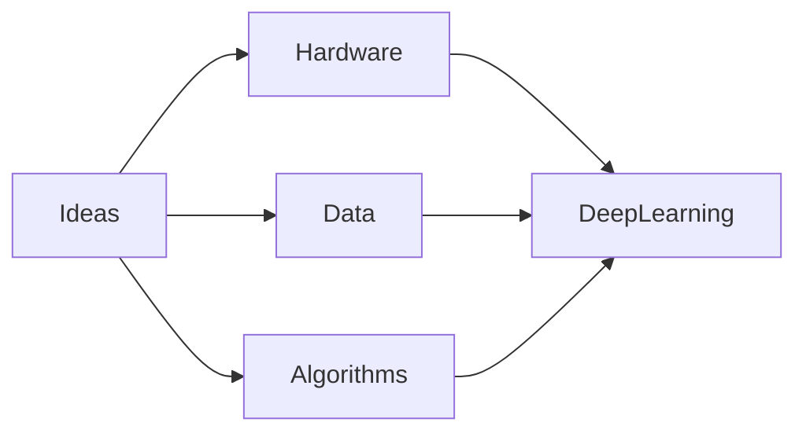

# 1.3 Why Deep Learning? Why Now?

> **Learning Objectives**
>
> After completing this chapter, you should be able to:
>
> - Explain why deep learning became successful after 2012.
> - Understand the importance of hardware, datasets, and algorithms.
> - Describe the role of GPUs and TPUs.
> - Explain how large datasets accelerated AI.
> - Understand why deep learning is scalable.
> - Recognize the future direction of deep learning.

---

# Table of Contents

- Introduction
- Why Deep Learning Emerged
- Three Driving Forces
- 1.3.1 Hardware
- 1.3.2 Data
- 1.3.3 Algorithms
- 1.3.4 A New Wave of Investment
- 1.3.5 Democratization of Deep Learning
- 1.3.6 Will It Last?
- Summary
- Interview Questions
- Exercises
- Related Notes

---

# Introduction

> Introduce the question:
>
> *If neural networks were invented decades ago, why did deep learning become revolutionary only in the last decade?*

---

# Why Did Deep Learning Become Popular?



---

# Timeline of the Deep Learning Revolution

```text
1980s
│
Backpropagation
│
1990s
│
CNN • LSTM
│
2006
│
Deep Learning Renaissance
│
2012
│
AlexNet wins ImageNet
│
2017
│
Transformer Architecture
│
2020
│
Foundation Models
│
2022+
│
Generative AI
```

---

# Three Key Driving Forces

| Factor | Role |
|---------|------|
| Hardware | |
| Data | |
| Algorithms | |

---

# 1.3.1 Hardware

## Introduction

## Evolution of Computing Hardware

## CPUs

## GPUs

## CUDA

## Tensor Processing Units (TPUs)

## AI Accelerators

## Parallel Computing

## Distributed Training

## Hardware Comparison

| Hardware | Characteristics | Typical Use |
|----------|-----------------|-------------|
| CPU | | |
| GPU | | |
| TPU | | |
| NPU | | |

---

# Hardware Evolution

```text
CPU

↓

Multi-core CPU

↓

GPU

↓

TPU

↓

AI Accelerators
```

---

# 1.3.2 Data

## Why Data Matters

## Big Data

## Internet Era

## Public Datasets

### ImageNet

### COCO

### MNIST

### Common Crawl

### Wikipedia

### LAION

## Data Annotation

## Benchmarks

## Data Quality

## Summary

---

# Growth of Data

```text
Internet

↓

Users

↓

Digital Content

↓

Large Datasets

↓

Better AI Models
```

---

# 1.3.3 Algorithms

## Introduction

## Better Activation Functions

## Better Weight Initialization

## Better Optimizers

- SGD
- Momentum
- RMSProp
- Adam
- AdamW

## Batch Normalization

## Residual Connections

## Dropout

## Attention

## Transformers

## Summary

---

# Evolution of Deep Learning Algorithms

```text
Perceptron

↓

Backpropagation

↓

CNN

↓

LSTM

↓

Residual Networks

↓

Attention

↓

Transformer

↓

Foundation Models
```

---

# 1.3.4 A New Wave of Investment

## Industry Adoption

## Cloud Computing

## Open Source

## Research Labs

### Google DeepMind

### OpenAI

### Meta AI

### Microsoft Research

### Anthropic

### NVIDIA

## Venture Capital

## AI Startups

## Summary

---

# AI Investment Timeline

```text
Academic Research

↓

Industry Research

↓

Cloud AI

↓

Foundation Models

↓

Generative AI

↓

AI Everywhere
```

---

# 1.3.5 Democratization of Deep Learning

## Open-Source Frameworks

### TensorFlow

### PyTorch

### Keras

### JAX

## Hugging Face

## Google Colab

## Kaggle

## Cloud Platforms

- AWS
- Azure
- Google Cloud

## Pretrained Models

## Open Datasets

## Summary

---

# Deep Learning Ecosystem

```text
Hardware

↓

Frameworks

↓

Libraries

↓

Datasets

↓

Pretrained Models

↓

Applications
```

---

# 1.3.6 Will It Last?

## Strengths

## Limitations

## Future Trends

## Scaling Laws

## Efficient AI

## Multimodal Models

## Edge AI

## AI Agents

## Scientific AI

## Responsible AI

## Summary

---

# Why Deep Learning Continues to Grow

| Factor | Impact |
|---------|--------|
| Hardware | |
| Data | |
| Algorithms | |
| Cloud Computing | |
| Open Source | |
| Investment | |

---

# Key Technologies

| Technology | Purpose |
|------------|---------|
| CUDA | |
| GPU | |
| TPU | |
| TensorFlow | |
| PyTorch | |
| Keras | |
| Hugging Face | |
| ImageNet | |
| Transformer | |

---

# Interview Questions

1. Why did deep learning become popular after 2012?
2. Why are GPUs important?
3. What is CUDA?
4. Compare CPU, GPU, and TPU.
5. Why is ImageNet significant?
6. What role do algorithms play?
7. Why are transformers considered revolutionary?
8. How did open-source frameworks accelerate AI?
9. Why is cloud computing important for deep learning?
10. Will deep learning continue to dominate AI?

---

# Exercises

- Research the ImageNet competition.
- Compare GPU and TPU architectures.
- List five milestones that accelerated deep learning.
- Explore a modern deep learning framework (TensorFlow or PyTorch).

---

# Summary

- Key concepts learned
- Major technological breakthroughs
- Hardware evolution
- Data revolution
- Algorithmic improvements
- Industry adoption

---

# Related Notes

- [[Artificial Intelligence]]
- [[Machine Learning]]
- [[Deep Learning]]
- [[History of Machine Learning]]
- [[Convolutional Neural Networks]]
- [[Recurrent Neural Networks]]
- [[Transformers]]
- [[GPU Computing]]
- [[CUDA]]
- [[Tensor Processing Unit]]
- [[ImageNet]]
- [[Backpropagation]]
- [[Gradient Descent]]
- [[TensorFlow]]
- [[PyTorch]]
- [[Keras]]
- [[Foundation Models]]