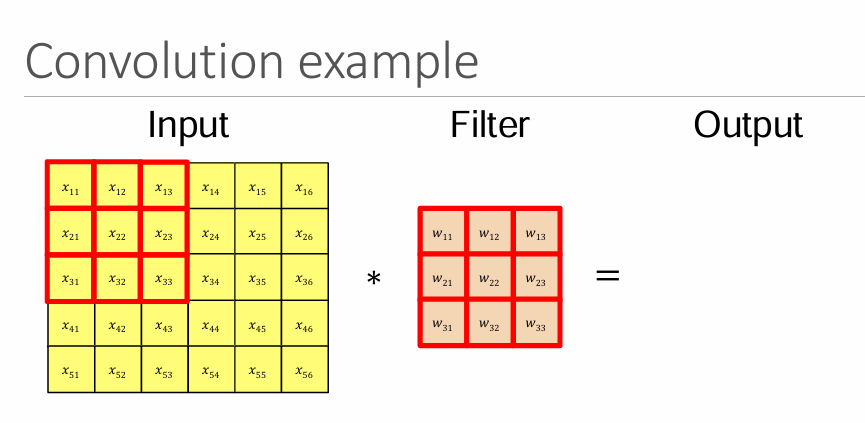

# comparison betweeen Traditional NN and CNN

#### 👀 Normal NN = looking at a photograph as a list of numbers
#### 👀 CNN = looking at the photograph through a small window

|                     | **Normal NN**               | **CNN**                              |
| ------------------- | --------------------------- | ------------------------------------ |
| Input               | Often flattened             | Image tensor                         |
| Main layer          | Fully connected / Linear    | Convolution                          |
| Spatial information | Not explicitly preserved    | Preserved                            |
| Connections         | Dense                       | Local receptive fields               |
| Weights             | Different connections       | Filters shared across locations      |
| Feature learning    | General                     | Local → hierarchical visual features |
| Best suited for     | General tabular/vector data | Images/spatial data                  |

## Simple connection

                 NEURAL NETWORK
                       │
          ┌────────────┴────────────┐
          │                         │
     Fully Connected               CNN
          │                         │
       Flatten                 Convolution
          │                         │
      Dense layers                ReLU
          │                         │
        Output                  Pooling
                                    │
                              Dense layers
                                    │
                                  Output

# From input image to kernel relation

<!-- ## Video -->

<!-- <video controls width="100%">
      <source src="../../../videos/1.mp4" type="video/mp4">
      Your browser does not support the video tag.
</video> -->

